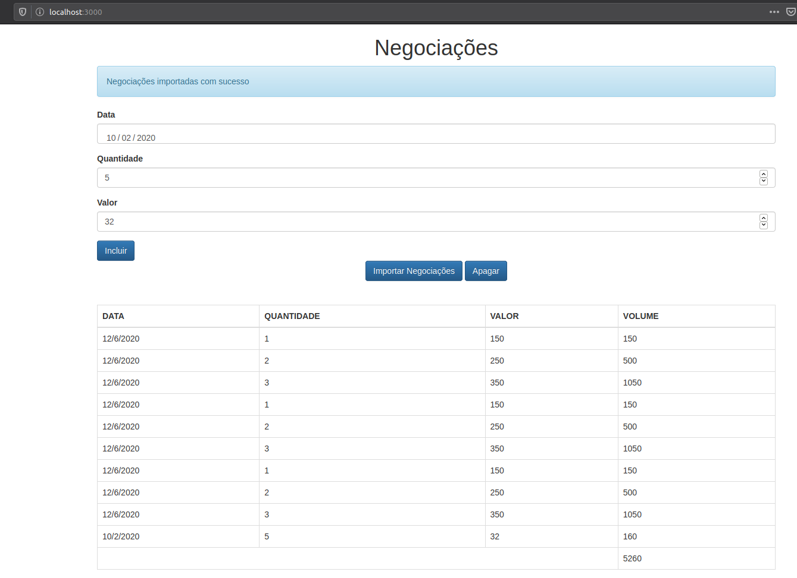

## Prints das telas desenvolvidas
<h1>
    
</h1>


## 🔖 Sobre

Projeto desenvolvido com Alura JS, sistema de cadastro de negociações e importações, onde esse
os dados são gerados de formas randômicas. Passando por padrões de projeto como:
 MVC, Proxy, Factory e Promise.

---

# [I][n][d][i][c][e]

- [Sobre](#-sobre)
- [Tecnologias Utilizadas](#-tecnologias-utilizadas)
- [Como baixar o projeto](#-como-baixar-o-projeto)

## 🔖 Sobre

Sistema de cadastro de negóciações e importação do mesmo com dados randômicos.

---

## 🚀 Tecnologias utilizadas

O projeto foi desenvolvido utilizando as seguintes tecnologias

- [HTML](https://developer.mozilla.org/pt-BR/docs/Web/HTML)
- [JavaScript](https://developer.mozilla.org/pt-BR/docs/Aprender/JavaScript)

---

## 🎓 Quem ministrou?

Alura.com


## 🗂 Como baixar o projeto

```bash

    # Clonar o repositório
    $ git clone https://github.com/CleytonPinheiro/jsavancado.git

    # Entrar no diretório
    $ cd jsavancado/server

    #Subir o servidor local, digitando o comando:
    $ npm start

    # Iniciar o projeto
    $ abrir no navegador: localhost:3000
```

---

